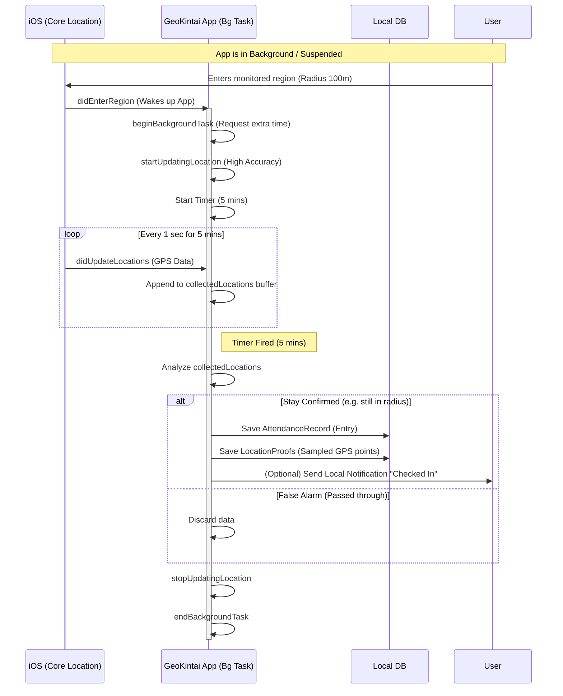
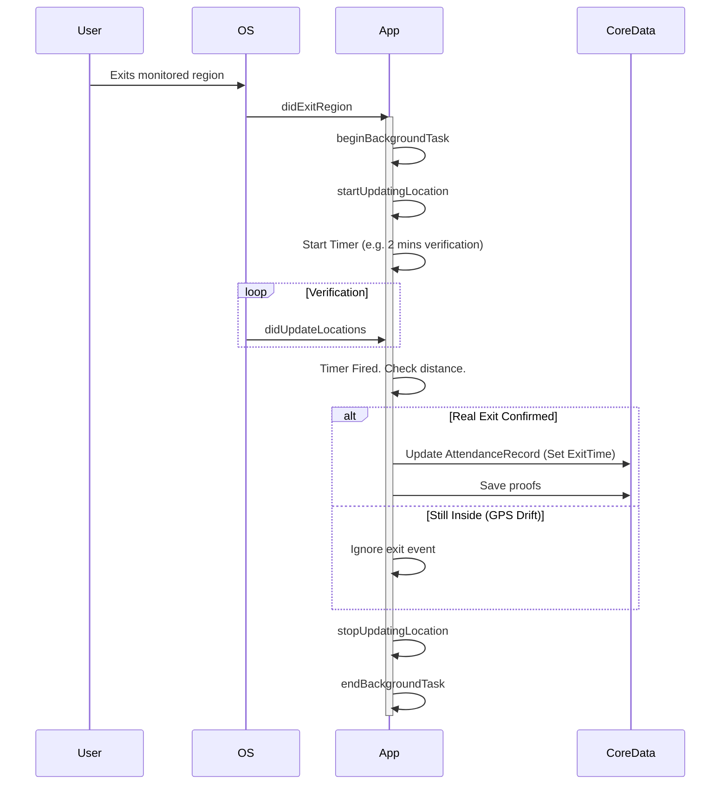

# Logic Flow (Sequence Diagram)

## 1. Background Entry Detection & Monitoring Logic

This diagram illustrates how the app handles geofence entry, background execution, and "stay" confirmation.

## 2. Exit Logic

Similar logic applies to exit, but with a "debounce" buffer to prevent accidental checkout due to GPS drift.

