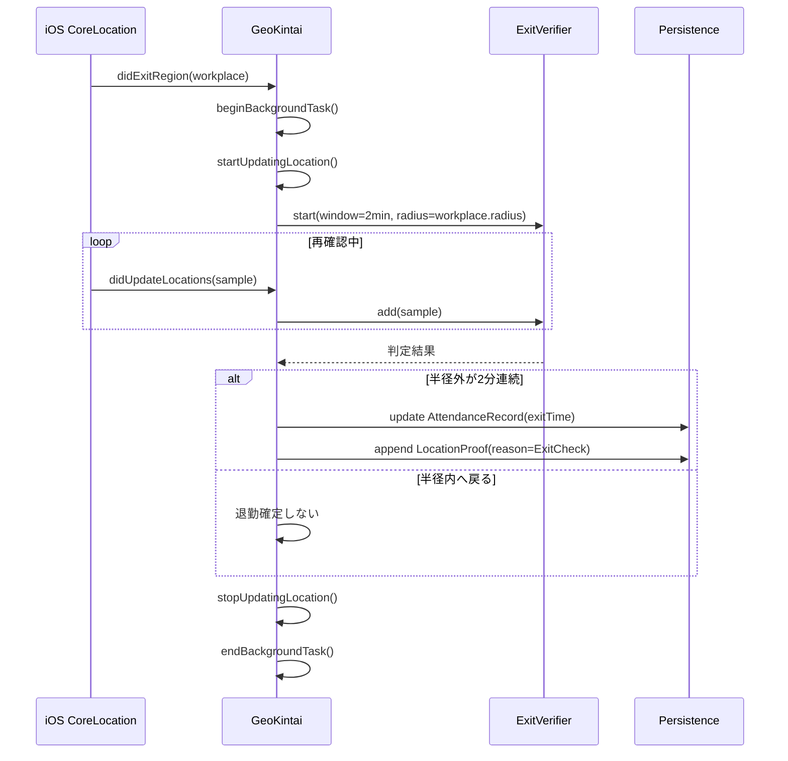
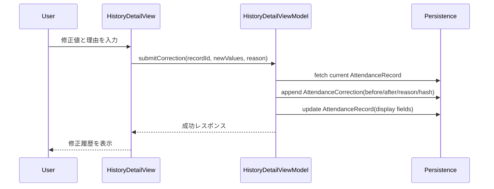
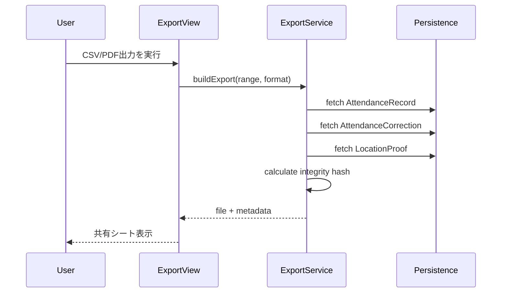

# ロジックフロー

GeoKintai の主要ドメインイベント（入域、滞在判定、退域、修正、エクスポート）の時系列を示す。  
詳細な合格条件は [acceptance_criteria.md](acceptance_criteria.md) を参照する。

## 1. 出勤確定フロー（FR-02 / FR-03）

## 2. 退勤確定フロー（FR-04）

## 3. 手動修正フロー（FR-06）

## 4. エクスポートフロー（FR-08 / FR-10）

## 5. 失敗時分岐
- 位置権限不足: 自動記録は停止し、設定導線を表示する（FR-09）。
- GPS 取得失敗: 現サイクルを中断し、次イベントで再試行する。既存データは保持する。
- 永続化失敗: ユーザー通知し、ログに失敗種別を記録する。

## 6. 関連文書
- [specification.md](specification.md)
- [acceptance_criteria.md](acceptance_criteria.md)
- [tdd_guide.md](tdd_guide.md)
- [simulator_test_plan.md](simulator_test_plan.md)
